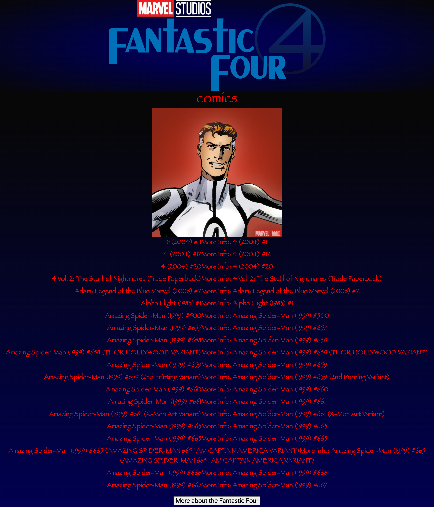

<ul>
<h1>Fantastic Four API</h1>
<li>We've created a page where the user can find information about the four main characters from the fantastic four heroes.</li>
<li>Technologies used - Bootstrap, HTML, CSS, Materialize, JavaScript</li>
<li>How to use it:  Simply scroll down to the character of your choice and click "info" to start fetching the informations about them. </li>
<li><a href="https://lilslash.github.io/MarvelProject/">Link to the live site</a></li>
<li><a href="https://github.com/lilslash/MarvelProject">Link to GITHUB Repository</a></li>

  
<li>Screenshots:</li>
   
   
</ul>
